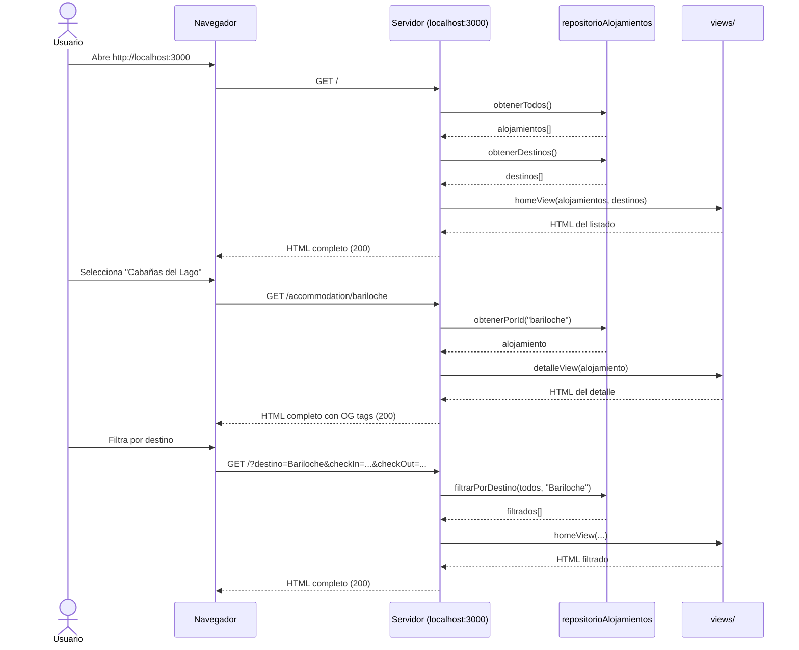

# SSR con Remix y Vanilla — Buscador de Alojamientos

[](https://github.com/uqbar-project/eg-hoteleria-ssr-react/actions/workflows/build-vanilla.yml)
[](https://codecov.io/gh/uqbar-project/eg-hoteleria-ssr-react)
[](https://github.com/uqbar-project/eg-hoteleria-ssr-react/actions/workflows/build-remix.yml)
[](https://codecov.io/gh/uqbar-project/eg-hoteleria-ssr-react)

Proyecto didáctico de Server-Side Rendering (SSR) con dos implementaciones
paralelas en un mismo monorepo: **Remix** (React full-stack framework) y
**Vanilla** (Node.js puro con template literals). Ambas comparten el modelo de
dominio y los datos mock en el paquete `shared/`.

## ¿Por qué SSR?

En este ejemplo cada ruta (`/`, `/accommodation/:id`) genera **HTML completo en
el servidor** y lo envía al navegador. Esto trae varias ventajas frente a una
SPA que renderiza todo con JavaScript en el cliente:

### SEO

Los motores de búsqueda (Google, Bing, etc.) indexan páginas a partir del
contenido HTML que reciben. Con SSR el servidor devuelve HTML con títulos,
descripciones, precios y servicios de cada alojamiento; toda esa información
participa del indexado y puede aparecer en los resultados de búsqueda. En
cambio, en una SPA (CSR) el HTML inicial está prácticamente vacío —el
contenido se completa con un fetch posterior a la inicialización de
JavaScript— por lo que los alojamientos de nuestros clientes no serían
indexados.

Cada página de detalle tiene además sus propias meta tags
(`og:title`, `og:description`, `og:image`) para que al compartir el link en
WhatsApp, Twitter o Slack se vea una tarjeta con imagen, título y descripción.

### Compartir en redes

Como cada alojamiento tiene una URL única (`/accommodation/bariloche`) y el
servidor devuelve HTML con meta tags OG, al pegar el link en cualquier red
social se genera una previsualización rica. No hace falta que el destinatario
tenga JavaScript activado ni que espere a que una SPA cargue para ver el
contenido.

### HTML disponible sin JavaScript

| Aspecto | SPA típica | SSR (Vanilla) | SSR (Remix) |
|---|---|---|---|
| HTML inicial | Vacío (solo `<div id="root">`) | Completo con todos los datos | Completo con todos los datos |
| Bundle JS | ~150–300 KB obligatorio | ~1 KB (solo Web Share) | ~150 KB (hidratación) |
| Funciona sin JS | No | Sí | No (router client-side) |
| Primer paint | Requiere descargar + parsear + ejecutar JS | HTML inmediato | HTML inmediato |
| Navegación entre páginas | Instantánea (router client-side) | Recarga completa | Instantánea (router client-side) |

La versión **Vanilla** envía HTML puro; el único JS (~1 KB) agrega el botón
"Compartir" solo si el navegador soporta Web Share API. La página es funcional
al 100 % incluso con JavaScript
desactivado.

La versión **Remix** también genera HTML en el servidor, pero a diferencia de
Vanilla, los **mismos componentes React** que se usaron para renderizar el HTML
en el servidor se envían como bundle JS al cliente. Allí React los **hidrata**:
reconoce el HTML que ya está en el DOM (el que generó el servidor) y lo
"conecta" con los componentes, agregando manejadores de eventos y preparando el
router para las transiciones client-side. Hasta que la hidratación termina la
página se ve completa pero no es interactiva (los clicks hacen navegación
tradicional). Una vez hidratada, las transiciones entre rutas se manejan desde
el cliente sin recargar la página. Si se desactiva JS, Remix degrada a una
navegación tradicional (cada click recarga la página completa desde el
servidor).

### Performance

> ¿Se puede medir? Sí. Los tests de frontend de este proyecto ya verifican
> tiempos de respuesta del servidor Vanilla. Como ejercicio, se podrían agregar
> benchmarks que comparen:
>
> - **TTFB** (Time To First Byte) entre Vanilla, Remix y una hipotética SPA.
> - **Tamaño de payload** de la respuesta HTML vs JSON de una API.
> - **Cantidad de requests** necesarios para renderizar la página completa.

## Estructura del monorepo

```
eg-hoteleria-ssr-react/
├── pnpm-workspace.yaml
├── package.json              # raíz: scripts, biome, vitest
├── tsconfig.json             # base compartida
├── vitest.config.ts
├── shared/                   # ♻️ modelo de dominio compartido
│   ├── package.json
│   ├── models/alojamiento.ts
│   ├── data/alojamientos.ts
│   └── repositories/alojamientos.ts
├── remix/                    # ⚛️ implementación con Remix
│   ├── package.json
│   ├── tsconfig.json
│   ├── vite.config.ts
│   └── app/
│       ├── root.tsx
│       ├── tailwind.css
│       └── routes/
│           ├── _index.tsx
│           └── accommodation.$id.tsx
└── vanilla/                  # 🏗️ implementación con Node.js puro
    ├── package.json
    ├── tsconfig.json
    ├── server.ts
    ├── escapeHtml.ts
    ├── views/
    │   ├── layout.ts
    │   ├── home.ts
    │   └── detalle.ts
    └── public/
        └── client.ts
```

## Cómo ejecutar

```bash
pnpm install

# Vanilla SSR (Node + tsx, sin frameworks)
pnpm dev:vanilla        # http://localhost:3000

# Remix SSR (React full-stack)
pnpm dev:remix          # http://localhost:5173

# Tests
pnpm test               # una vez
pnpm test:watch         # modo watch
```

---

## 🏗️ Vanilla SSR


Aquí vemos que

- al buscar Bariloche se manda un pedido al server con el destino = "Barioche"
- el server resuelve la búsqueda y responde HTML, con meta tags de Open Graph (og) que entienden las redes sociales o Whatsapp
- cuando hacemos click sobre la imagen, volvemos a hacer una búsqueda al server con el id del hotel (accomodation)
- el server vuelve a responder con un HTML
- lo único que llega de javascript es lo que necesita Tailwind (el framework de CSS) y un archivo client.js que es el compilado de nuestro archivo [client.ts](./vanilla/public/client.ts), que habilita la posibilidad de compartir el hotel para dispositivos que lo soportan (principalmente móviles)

### Stack

- **Servidor**: Node.js HTTP nativo, sin frameworks.
- **Runtime**: `tsx` (TypeScript ejecutado directamente, sin compilación previa).
- **Vistas**: Template literals con `escapeHtml` para sanitización. Como las
  vistas son strings armados por concatenación, cualquier texto que contenga un
  alojamiento (título, descripción, destino, servicios) podría incluir caracteres
  `<>"&` que rompen el HTML o peor, permiten inyectar scripts (XSS). La función
  `escapeHtml` reemplaza esos caracteres por sus entidades HTML
  (`&lt;`, `&gt;`, `&quot;`, `&amp;`), exactamente como lo haría React
  automáticamente con JSX. En Remix esto no hace falta porque React ya escapa
  las variables en las templates.
- **Estilos**: Tailwind CSS vía CDN.
- **Cliente**: `public/client.ts` → compilado con esbuild → `build/client.js`.

### Arquitectura



### Rutas

| Ruta | Método | Descripción |
|---|---|---|
| `/` | GET | Listado con formulario de búsqueda y filtro por destino |
| `/?destino=X&checkIn=Y&checkOut=Z` | GET | Listado filtrado con cálculo de precio |
| `/accommodation/:id` | GET | Detalle del alojamiento con OG meta tags |
| `/static/*` | GET | Archivos estáticos (desde `build/`) |
| cualquier otra | GET | 404 |

### Flujo de render

Cada ruta se maneja con una función `async` que:
1. Obtiene datos del repositorio (con un delay simulado de 100ms).
2. Pasa los datos a la función `view` correspondiente.
3. Envuelve el HTML generado en el `layout` (head, header, footer).
4. Envía la respuesta con el status HTTP adecuado.

### Archivos clave

| Archivo | Rol |
|---|---|
| `server.ts` | Ruteo, manejo de errores, sirve estáticos |
| `views/layout.ts` | Shell HTML con meta tags, OG, Tailwind CDN |
| `views/home.ts` | Template del listado con formulario y grilla de cards |
| `views/detalle.ts` | Template del detalle con servicios, opiniones, botón compartir |
| `escapeHtml.ts` | Sanitización de strings para evitar XSS |
| `public/client.ts` | Hidratación progresiva del botón compartir |

---

### Otras cuestiones del desarrollo

- El acceso al origen de datos no requiere filtrar información en el cliente, por lo que es una mejora en cuanto a seguridad (en el navegador no queda claro si nuestro server es un BFF - backend for frontend o una aplicación completa)
- El flujo de trabajo es más simple: los hooks se reemplazan por llamadas al server donde el formulario en html guarda el estado que se pasa como información. Fijense que no hay `useState`, `useEffect` ni similar.
- Caching de páginas => si varios usuarios piden la misma información (y no cambia tan seguido) podemos implementar un mecanismo de cache para acelerar los tiempos de respuesta
- El modelo SSR puro (Vanilla) limita la interacción del lado cliente. Sin JavaScript
  no hay eventos (`click`, `change`, `input`), no hay `window` ni `localStorage`.
  Todo lo que requiera interactividad en tiempo real necesita un enfoque distinto.

  **Ejemplo — El botón Compartir (`public/client.ts`):**
  El servidor renderiza el botón con clase `hidden`. Luego `client.ts` detecta si el
  navegador soporta `navigator.share` (Web Share API) y, de ser así, lo muestra y
  le asigna el evento `click`. Esta técnica se llama **hidratación progresiva**: el
  server entrega HTML completo y funcional, y el JS cliente solo mejora ciertos
  nodos. Para interacciones más complejas (autocomplete, drag & drop,
  infinite scroll) haría falta más JS cliente — o migrar a Remix, que lo maneja
  con `<Scripts />` y progressive enhancement sin esfuerzo manual.

---


## ⚛️ Remix SSR

Con Remix como framework wrappeando las llamadas al server:


Inhabilitando JS en el servidor (líneas 37-38 de `root.tsx`):

```tsx
        {/* <ScrollRestoration />
        <Scripts /> */}
```


### Stack

- **Framework**: Remix v2 (React Router, SSR nativo).
- **Build**: Vite con `@remix-run/dev` y `vite-tsconfig-paths`.
- **Estilos**: Tailwind CSS v4 vía `@tailwindcss/vite`.
- **Ruteo**: File-based routing en `app/routes/`.

### Arquitectura

```
cliente (navegador)
  ↓  GET /, GET /accommodation/:id
servidor Remix
  ↓  ejecuta el loader de la ruta
loader(_index.tsx)  →  repositorioAlojamientos (shared/)
  ↓
retorna { alojamientos, destinos, ... }
  ↓
Remix renderiza el componente React a HTML
  ↓  (con JS)
fetch al loader → JSON → re-render parcial
  ↓  (sin JS)
GET tradicional → HTML completo → page reload
```

### Progressive Enhancement

El `<Form method="get">` de `_index.tsx` no es un `<form>` común. Cuando hay
JavaScript disponible, Remix intercepta el submit, serializa los campos a
query params y hace un `fetch()` al servidor. El servidor ejecuta el **loader**
de la ruta y devuelve **JSON** (no HTML); Remix recibe ese JSON y re-renderiza
solo la parte de la página que cambió (los resultados del filtro), sin perder
el scroll, sin flash blanco, sin recargar el CSS ni las imágenes. Todo desde
una sola llamada HTTP.

**Ventaja sobre Vanilla SSR**: En Vanilla cada submit es un GET tradicional que
devuelve HTML completo; el navegador descarta y re-pinta todo el documento
(parpadeo, pérdida de scroll, recarga de recursos). Remix en cambio pide solo
los datos (JSON) y actualiza el DOM automáticamente, dando una experiencia
cercana a una SPA pero sin dejar de ser SSR.

**Ventaja sobre CSR puro**: Una SPA necesita JavaScript obligatoriamente para
siquiera mostrar la página —sin JS el usuario ve una pantalla en blanco. Además,
cada interacción requiere un fetch a una API externa con su propia lógica de
estado, caching y errores. Remix en cambio funciona sin JavaScript
(cae a GET+HTML tradicional) y no expone una API aparte: el loader es tanto la
fuente de datos para el SSR como el endpoint que consume el fetch client-side.


| Re-render parcial sin flash | Page reload completo |
| Como SPA (rápido, fluido) | Como HTML clásico (funcional) |

### Ejemplo: el loader

```ts
// remix/app/routes/_index.tsx
export async function loader({ request }: LoaderFunctionArgs) {
  const url = new URL(request.url)
  const destino = url.searchParams.get('destino') ?? ''

  const alojamientos = await repositorioAlojamientos.obtenerTodos()
  const filtrados = repositorioAlojamientos.filtrarPorDestino(alojamientos, destino || undefined)

  return { alojamientos: filtrados, destino }
  //              ^^^^^
  // Con JS: vuelve como JSON al cliente, Remix lo hidrata
  // Sin JS: el servidor serializa esto, lo mete en el HTML y lo envía completo
}
```

### Archivos clave

| Archivo | Rol |
|---|---|
| `app/routes/_index.tsx` | Home: loader con filtros + componente con Form y cards |
| `app/routes/accommodation.$id.tsx` | Detalle: loader con 404 + meta OG + componente |
| `app/root.tsx` | Layout shell de Remix |
| `vite.config.ts` | Config de Vite con plugins de Remix y Tailwind |

---

## 🔄 Comparativa Vanilla vs Remix

| Aspecto | Vanilla | Remix |
|---|---|---|
| **Código servidor** | Node HTTP nativo, ~160 líneas | Remix lo abstrae completamente |
| **Vistas** | Template literals (strings) | Componentes React (JSX) |
| **Ruteo** | Manual con `if/else` + regex | File-based, automático |
| **Manejo de errores** | Try/catch manual en cada ruta | Error boundaries + Response throws |
| **SEO** | Meta tags manual en layout | `meta` export por ruta + `MetaFunction` |
| **Progressive enhancement** | No aplica (siempre HTML completo) | Form → JSON con JS, HTML sin JS |
| **Hidratación** | Solo botón compartir | Todo el árbol React |
| **Bundle cliente** | ~1KB (esbuild) | ~150KB (React + Remix) |
| **Complejidad** | Baja, fácil de entender | Media, más abstracciones |
| **Flexibilidad** | Total (control absoluto) | Alta (convenciones) |

---

## 🔗 SSR con backend externo

Hoy los datos son mock, pero si el backend estuviera en otro repositorio el
cambio es mínimo:

- **`shared/repositories/alojamientos.ts`** — en lugar de datos mock, haría
  `fetch` a la API externa. Los loaders / handlers no se enteran: llaman al
  repositorio, y el repositorio decide de dónde saca los datos.
- **Tipos compartidos** — el tipo `Alojamiento` se duplica o se publica como
  paquete NPM compartido entre repos.
- **Manejo de errores** — hay que agregar try/catch por si la API falla
  (timeout, 500).
- **Autenticación** — si la API requiere token, el loader/handler lo pasa en
  headers. Como corre solo en servidor, el token nunca se filtra al cliente.

---

## 🧪 Tests


### Frontend (Vanilla SSR)

Los tests de frontend inician el servidor Vanilla en un puerto aleatorio y
verifican las respuestas HTTP:

- **Home** — status 200, título, formulario, grilla de cards, enlaces a detalle.
- **Filtro** — filtrado por destino, case insensitive, mensaje sin resultados,
  cálculo de precio con fechas.
- **Detalle** — status 200, título, datos del alojamiento, meta tags OG, 404
  para id inexistente.
- **404** — ruta inexistente devuelve 404 con mensaje.

### Cómo correr los tests

```bash
pnpm test          # ejecutar una vez
pnpm test:watch    # modo watch (re-ejecuta al cambiar archivos)
```

## Videos recomendados

- https://youtu.be/rGPpQdbDbwo